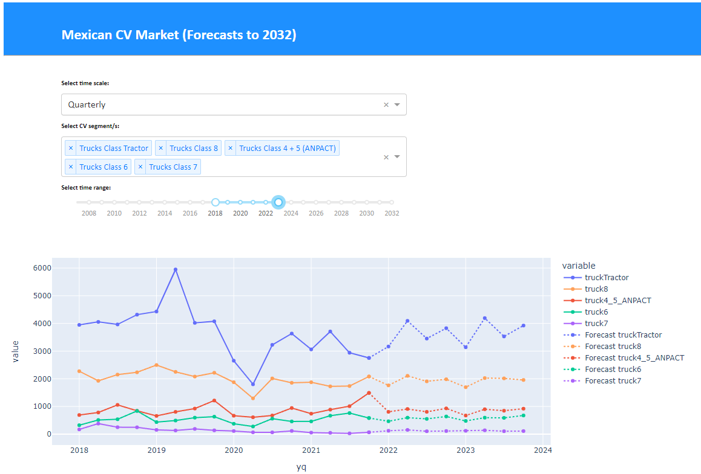

# Using Dash to create a CV Sales Dashboard!

The present dashboard-app has many cool features!
- Truck sales have been modeled and forecasted using [SARIMAx](https://www.statsmodels.org/devel/generated/statsmodels.tsa.statespace.sarimax.SARIMAX.html) and [Prophet](https://facebook.github.io/prophet/) models.
- The app is pulling the historic & forecast data from a MongoDB database hosted on Atlas using [pyMongo](https://pymongo.readthedocs.io/en/stable/)
- Scrapping functions are pulling new data from Mexican Commercial Vehicles Manufactrer's Association (ANPACT) reports, to compare our modeled forecasts with new reported sales data. The PDF reports have been scrapped using [Tabula.py](https://pypi.org/project/tabula-py/). If new data is reported, then it is stored in the MongoDB for future usage.
- The dashboard was created using [Dash](https://dash.plotly.com/introduction) ingregration with [Plotly-py](https://plotly.com/python/)! There are no HTML, JavaScript of CCS files needed!
- The app is soon to be deployed on Heroku ;) 

